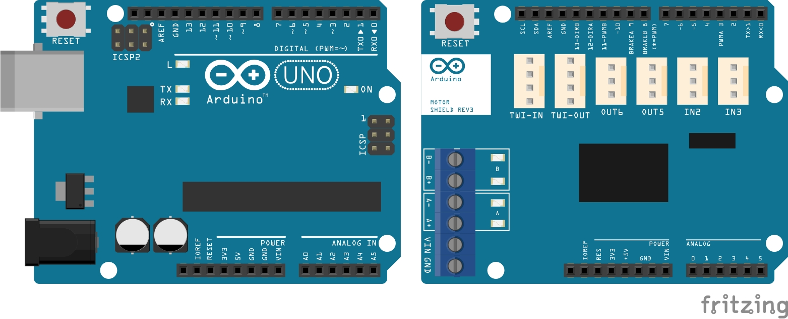
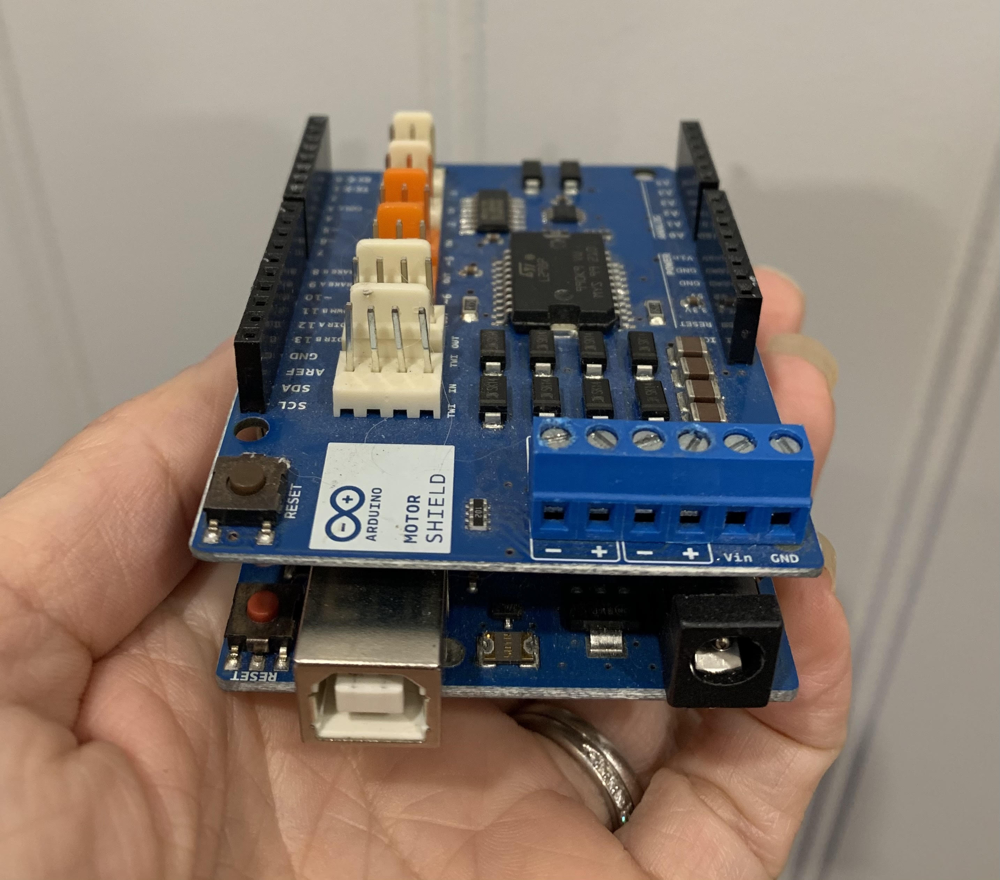
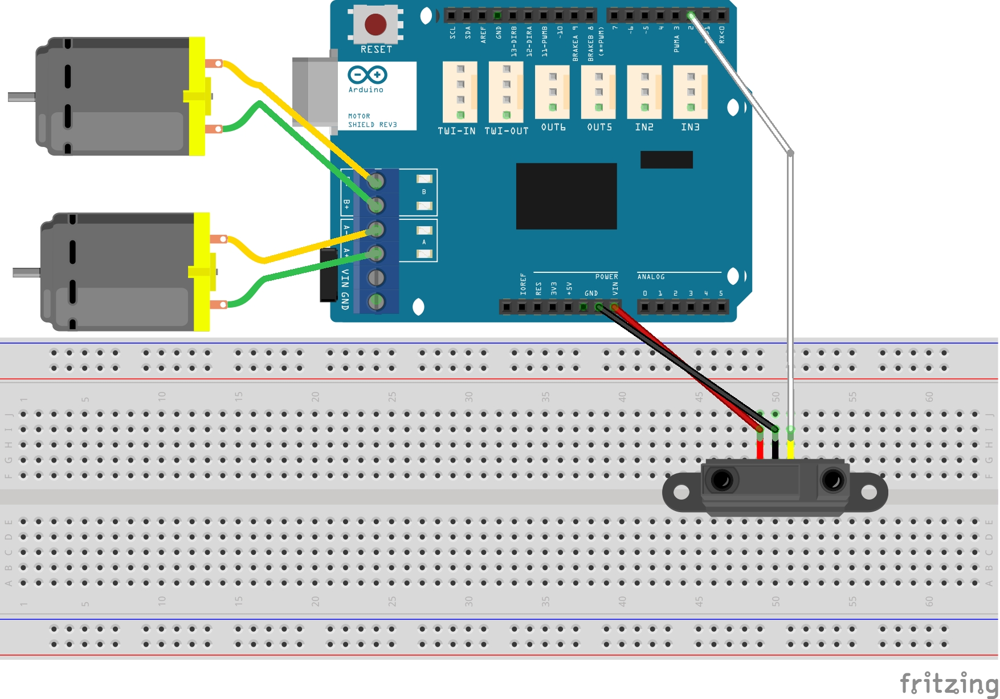
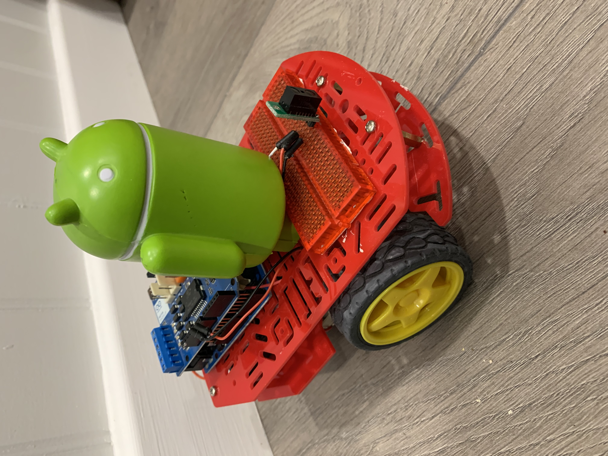
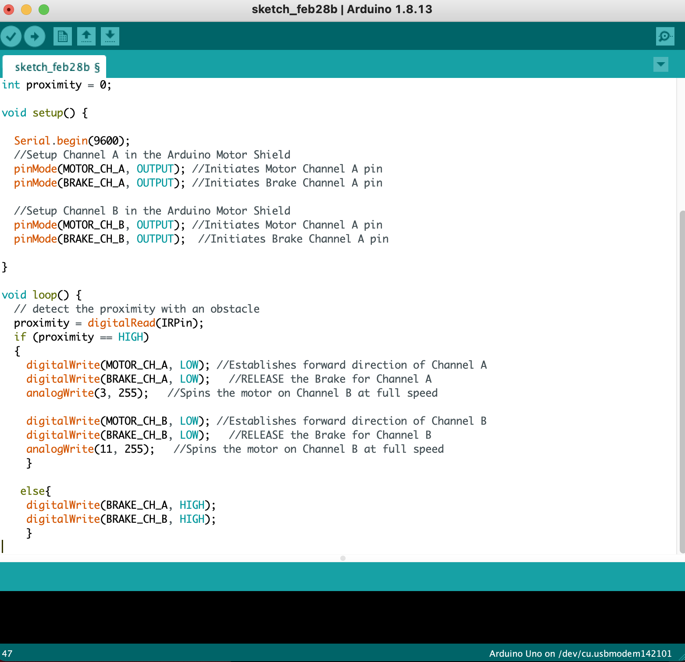
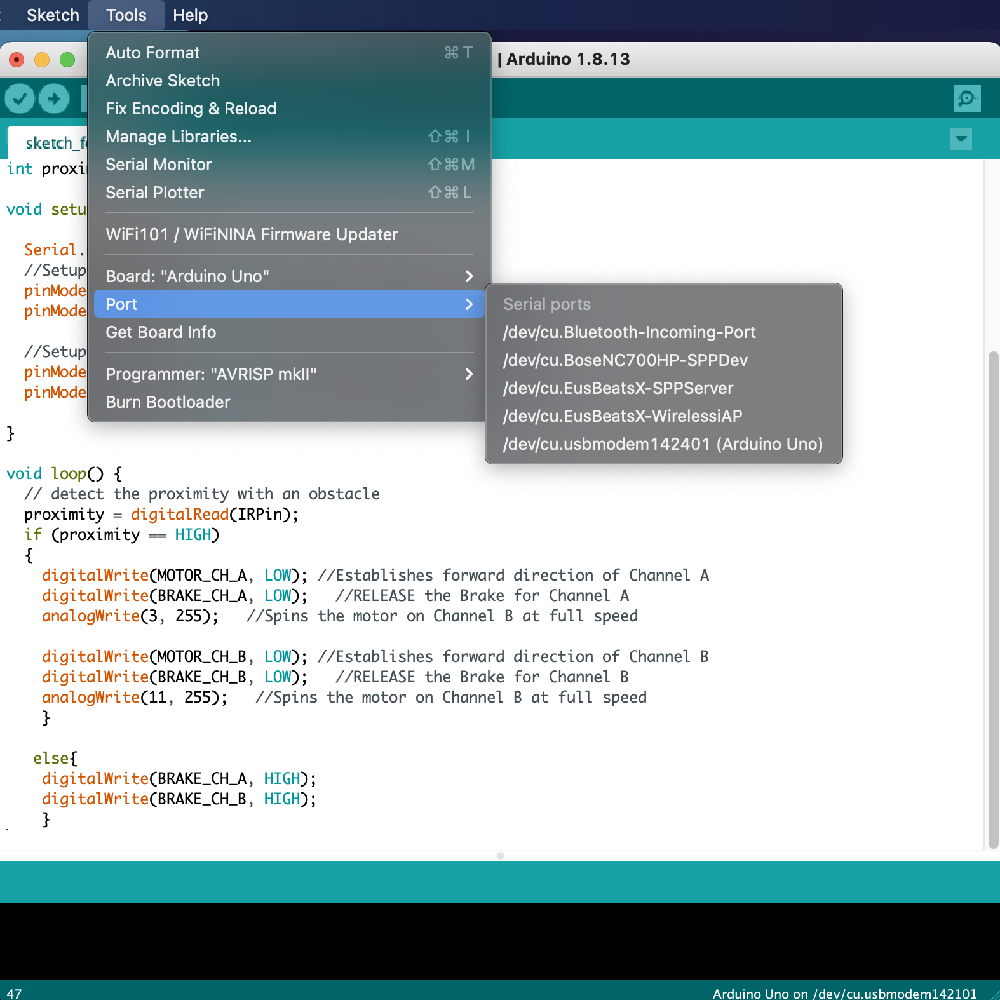

# Designing a motor powered arduino circuit using infrared sensor :robot:

This project has been developed by Dr Lara Suzuki :woman_technologist:  from Google Inc.

## Introduction
This tutorial will teach you how to build small robot that detects and avoids obstacles using infrared sensor.

The parts you are going to need are:

1. Arduino Uno
2. Arduino Motor Shield

3. Magician Chassis from [SparkFun](https://www.sparkfun.com/products/retired/10825)
4. Pololu [Infrared Sensor](https://shop.pimoroni.com/products/pololu-carrier-with-sharp-gp2y0d805z0f-digital-distance-sensor-5cm?variant=31546927841363&currency=GBP&utm_source=google&utm_medium=cpc&utm_campaign=google+shopping?utm_source=google&utm_medium=surfaces&utm_campaign=shopping&gclid=CjwKCAiAm-2BBhANEiwAe7eyFO7bK1mOrWGd_Cqj9JogPAQnLsCPM71dlVHjZsbjda6yJfE5k2bLcRoCz2UQAvD_BwE)
5. A breadboard
6. Wires

## Building the Magician Chassis
You should received 14 parts to assemble the Magician Chassis. Follow these [instructions](http://cdn.sparkfun.com/datasheets/Robotics/MagicianChassisInst.pdf) to build your magician chassis. 

## Assembling the Arduinos and the Infrared Sensor
Once you have completed the chassis, attach the **Arduino Motor Shield** on to the **Arduino Uno**. 

The schematic for the project is displayed below. The **two gearmotors** are connected to the motor ports A and B. The **infrared sensor** is connected to digital channel **2** on the Arduino Motor Shield and connected to the **out** pin on the sensor in the breadboard. In your breadboard, connect the **GND pin** to the **GND port**, and the **Vin pin** to the **Vin port** in the Arduino Motor Shield as per the schematic below.  

## The assembled robot

## Coding your project

Download the [Arduino IDE](https://www.arduino.cc/en/software). Once installed, click **File→New**. Copy the code from this repo **MortorInfrared.ino** and paste in the sketch window as shown below:

1. Connect your Arduino using the USB cable. The square end of the USB cable connects to your Arduino. 
2. Choose **Tools→Board→Arduino Uno** to find your board in the Arduino menu.
3. Choose the correct serial port for your board. You find a list of all the available serial ports by choosing **Tools→Port→comX** or /dev/cu.usbmodemXXXXX. X marks a sequentially or randomly assigned number. Unless you have another Arduino connected, it should be the only one visible. 

4. Finally, Click the Upload button. This is the button that points to the right in the Arduino environment. You can also use the keyboard shortcut Ctrl+U for Windows or Cmd+U for Mac OS X.
5. The code will be uploaded. You can now remove the USB cable and your robot should start moving forward.