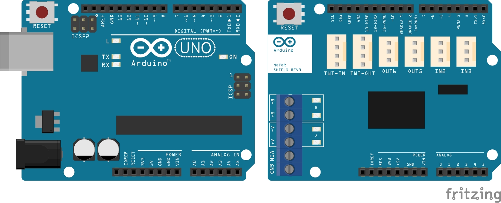

# Designing a motor powered arduino circuit using infrared sensor :robot:

This project has been developed by Dr Lara Suzuki :woman_technologist:  from Google Inc.

## Introduction
This tutorial will teach you how to build small robot that detects and avoids obstacles using infrared sensor.

The parts you are going to need are:

1. Arduino Uno
2. Arduino Motor Shield

3. Magician Chassis from [SparkFun](https://www.sparkfun.com/products/retired/10825)
4. Pololu [Infrared Sensor](https://shop.pimoroni.com/products/pololu-carrier-with-sharp-gp2y0d805z0f-digital-distance-sensor-5cm?variant=31546927841363&currency=GBP&utm_source=google&utm_medium=cpc&utm_campaign=google+shopping?utm_source=google&utm_medium=surfaces&utm_campaign=shopping&gclid=CjwKCAiAm-2BBhANEiwAe7eyFO7bK1mOrWGd_Cqj9JogPAQnLsCPM71dlVHjZsbjda6yJfE5k2bLcRoCz2UQAvD_BwE)
5. A breadboard
6. Wires

## Building the Magician Chassis
You should received 14 parts to assemble the Magician Chassis. Follow these [instructions](http://cdn.sparkfun.com/datasheets/Robotics/MagicianChassisInst.pdf) to build your magician chassis. Once you have completed the chassis, attach the **Arduino Motor Shield** on to the **Arduino Uno**. 
